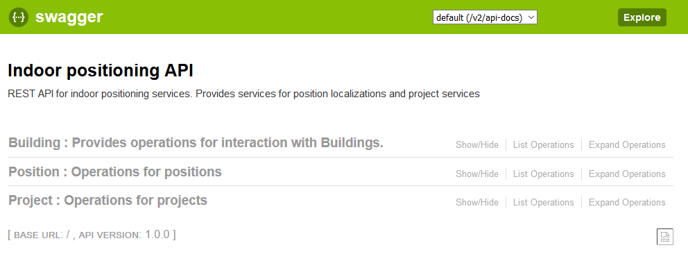
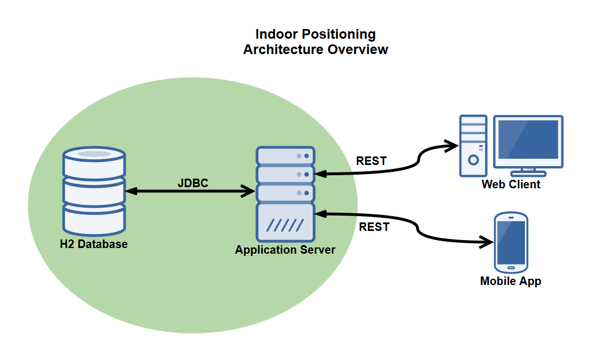
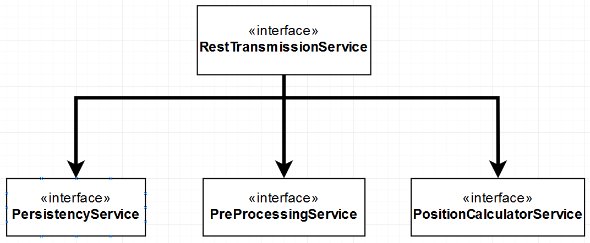
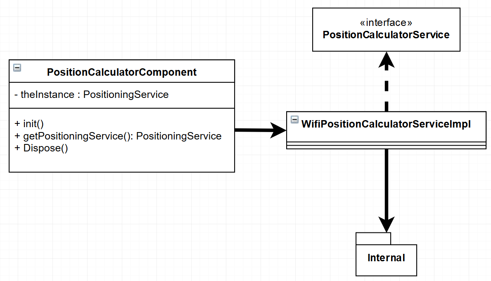
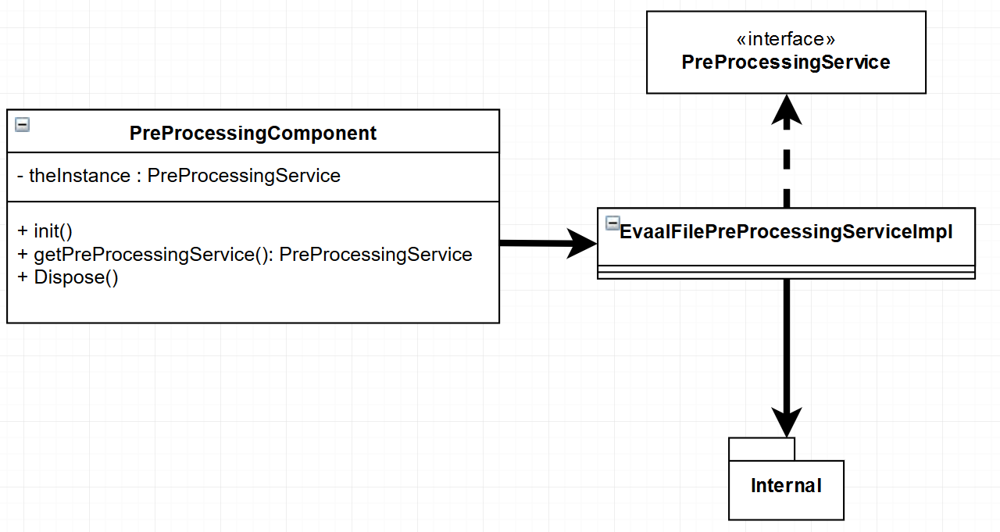

# Backend Overview

This section provides a general overview of the Backend. You find a description of the following things here:

- Description of the REST API provided by the application
- A small Architecture Overview of the project
- The Backend Architecture
- The architecture and functionality of the Persistence Layer
- Available automated tests

## Description of the REST API
This section provides an overview of the currently available REST API that this project offers. As soon as the 
application is running, a dynamically generated documentation can be found here: *http://ipAdress:port/swagger-ui.html#/*
If the application is running on your local machine, you would be able to access this documentation through: 
*http://localhost:8080/swagger-ui.html#*

Every operation provided by this application, is accessible through this interface. The implementation takes advantage 
of the *<b>Spring Web framework</b>* provided by <b>Spring</b>. This means that every REST call is available in certain 
API endpoint resources.

There are currently three main API endpoints and therefore functionalities available for this system. The *Positioning 
Controller Resource* which generally provides functionality concerning position calculation. The *Building Controller 
Resources* which generally provides functionalities concerning building associations and processing. Finally the *Project 
Controller Resource* which provides functionalities concerning project management and associations. These Ressources will 
now be further analyzed.

### Overview

As already mentioned, there are three main API endpoints available. Each of them provides a certain batch of functionalities
which are independent from each other. The following graph shows a general overview of the REST API.

The graph above is a screenshot directly taken from the dynamically generated documentation. The following chapters will
now showcase every endpoint in more detail.

### Buildings

First off, the building Controller handles all operations concerning building associations and processing. It provides 
a number of endpoints which allow the addition of buildings, the deletion of old buildings as well as many other functions.
The following graphic shows all available endpoints of the building Controller.

Just like before, this graphic is also a screenshot directly taken from the dynamically generated documentation. The building
Controller offers three types of requests for this service. <b>*GET*</b> requests return a wrapped Result object which contain all
requested data, given that the request was valid and that the wanted data is available. <b>*POST*</b> requests often require a 
wrapped request object which contains all the needed parameters in the request body. These requests often also return a
wrapped result object which contain a status message and, depending on the request type, a created identifier of the POST
process. Finally the <b>*Delete*</b> request just requires an identifier in the request header and also return a wrapped result
object.

### Projects

Next up, the Project Controller. This one handles all operations concerning projects of this application. The following 
graphic will now show all available endpoints for the Project Controller.

Like the Building Controller this graphic was also taken directly from the dynamic documentation. Generally, this 
Controller offers CRUD operations for projects. You can *Create*, *Read*, *Update* and *Delete* projects that are associated
with any positioning functionalities of this application. Any endpoint this Resource offers, features the mentioned 
request types that the Building Controller also offers.

### Positioning

Finally the Positioning Controller features the heart of this project. Every actual position calculation and algorithm 
application can be executed through this REST resource. The following graphic will now show the last part of the REST API.

Like with the other two Controllers, this graphic was also taken from the generated documentation. Here you can start 
certain PreProcessing functionalities and calculate positions based on the given pre processed data. At the moment there 
is only one available algorithm to calculate positions of a user. This can be extended in the future. As this REST resource
is build in a way to provide this functionality, only certain parameters need to change to allow other algorithm implementations
to take effect. The Backend then only needs to point at the correct service implementation. How the Backend is structured 
to allow this sort of behaviour, is described in the next chapter.

## Indoor Positioning Architecture Overview

The project itself consists of four different systems that communicate with each other. The Back End consists of a H2 
database and an Application server.  The Front End consists of two Clients. A Web Client and an Android App. 
The following figure provides a graphical representation of this architecture.

As you can see in the graphic above, the Application server and the database are communicating with each other over JDBC.
Note that in no place in the actual implementation, JDBC is actually coded. The application server uses JPA which in turn
uses JDBC to communicate with the database. The right hand side shows the two mentioned Clients. The Web Client can be 
accessed from a standard web browser, while App can be installed on an Android operated phone. Both clients communicate 
with the Back End over the already shown REST API.

## Backend Architecture

The Backend architecture section provides deeper insights into the general service oriented architecture of the 
application's BackEnd.

All functionalities that the application provides, are accessible through the REST API. The functionalities themselves 
are structured into three different Micro services. This generally has the advantage, that each service can run 
independently from each other and that a higher availability of the application itself is present. Keep in mind that 
this happens at the cost of performance as communication between the services requires the data to be converted into 
needed data structures.

The structure of this service oriented architecture and its functionalities will now be further analyzed.

### Service architecture overview

As already mentioned, there are three micro services currently available. These are structured similar to the 
available REST resources and are operating independently from each other.

The graphic above shows a simplified UML-Diagram which describes how the service architecture is structured. 
The top of the diagram shows the interface "RestTransmissionService" which works as a gateway between the REST Resource
endpoints and the provided functionality of the Back End. All Controllers are accessing the mentioned interface directly
while the implementation of that interface accesses the Micro Services shown at the bottom of the diagram. There is no 
direct connection between the REST endpoints and the provided services. This is done to keep every layer independent 
from each other and to provide a more clean and accessible structure. It is also possible to extend the given structure 
in order to let every component run on different machines and therefore have a more distributed system. 
The next chapters will now go into more detail about each shown Service.

### Persistency Service

The persistency service controls every access to and from the database. Like any other service, it needs to be 
initialized on application startup and disposed on application shutdown. To achieve these
requirements, this service has the following structure.

The left hand side of the UML diagram above, shows the component class of this service. It provides all functionalities 
required to initialize and dispose of the service implementation itself. *Spring* provides its own function to 
initialize and dispose of components during runtime. So this structure is not necessary in production environment.

However in cases Spring is not available, for example for Unit testing, the service has to be initialized and disposed of
with this component manually. The component class holds a *Singleton* reference to the service implementation and 
controls its access. This way all data access and changes are persistent throughout the system. Also the service
itself can be initialized and disposed of in a controlled way.

The top right corner of the diagram contains the service's interface itself. It provides access to the functionality of
the micro service. Below it lies the implementation of the service as well as all required functionalities which are not 
viewable by the public. The service accesses these functionalities but does not allow further modifications or 
examination to it.

### Positioning Service

The positioning service controls access to all positioning algorithms of this project. All positioning calculations and 
functionalities can only be accessed through this system. No data is being persisted in this micro service. In case you 
wanted to store calculated data in the database, you first need to access the *Positioning service* and then call 
the *Persistency service* to store returned data. The following graph shows a simplified UML diagram of this service.

As you can see, the general structure of this service is exactly the same as in the service above. 
Also the Calculator service shares this structure. The only difference lies within the service and its implementation 
itself. All internal functionalities as well as the used positioning algorithms themselves are stored withing the internal 
package of this service. This way the more detailed implementations are capsuled away from other developers and access
is controlled through the interface itself.

### Pre Processing Service

The Pre Processing service provides all kind of pre processing functionality. That includes Processing of certain Radiomap
or evaluation files. This is required in order for the calculation service to function properly. Just like the other two
services, this one is structured in the same way.

The only difference once again lies within the implementation and offered interface itself. Just like in the other services,
all internal functionalities are inside the associated internal package.

### Example Workflow

(Nico)
An example workflow that demonstrates how services can be called
using the REST API, how they interact in the backend, and how they
yield results. 

## Persistence Layer

The following section provides a short overview of the __persistence layer__ of the backend. Because it uses __Spring Data JPA__ 
as an intermediate layer above the database, we do not execute any SQL statements ourselves; instead, operations on the 
database are carried out using __Spring's repository mechanism__.

We'll start off with an overview of the __database model__, introducing you to the entities present in the database and how they
are connected to each other. After that, you'll learn about the __database entities__ in detail; that is, why the entity was introduced, 
which functions it serves in the backend, and why its relations to other entities are the way they are.
 

### Database Model

An overview of the database model can be taken from the image below. Entity types are marked in orange; relation types are 
marked in blue.

### Database Entities

This section explains the details of the database entities. We'll begin with one of the central entities -- the *EvaalFile* entity.

##### EvaalFile
The *EvaalFile* entity is where it all begins -- it's what all other entities are built upon (and no, the name 'Evaal' is not 
a typo -- it was chosen to take account of the fact that this entire project is dedicated to [this competition](http://evaal.aaloa.org)). 
One *EvaalFile* entity represents one processed smartphone sensor log file as recorded by the [GetSensorData 2.0 app](https://lopsi.weebly.com/downloads.html). It doesn't represent 
the entire source file line-by-line because the backend currently -- as of January 2018 -- only supports the WIFI algorithm for 
position calculation which only requires POSI and WIFI lines, hence persisting the entire file, including other content lines as 
well, would be a waste of both processing time and memory.

Each *EvaalFile* entity is recorded in exactly one building (it says in the competition rules that one recording run does not span 
multiple buildings, but might include several floors), is connected to exactly one *RadioMap* entity, and has a list of 
*WifiBlock* entities attached to it. The *RadioMap* is processed from the source file using both its POSI and WIFI lines, 
whereas the list of *WifiBlocks* is extracted using only the WIFI lines.  

#### RadioMap
If *EvaalFile* is the most important entity, then *RadioMap* is the second-most important one because it contains -- encapsulated 
in its sub-entity, which we'll have a look at a bit further in -- the basis for the WIFI-algorithm-based position calculation: 
the radio map processed from one *EvaalFile*. These two entities -- *EvaalFile* and *RadioMap* -- share a one-to-one relationship 
because no matter how often the processing steps are run on the source file, the resulting radio map will always be the same and each 
resulting radio map, of course, has to be connected to its original source file, represented by the according *EvaalFile* 
entity. 

Each *RadioMap* entity consists of arbitrarily many, but at least one entity of 
type *RadioMapElement*. The *RadioMapElements*, in turn, contain the data that is used during position 
calculation using the WIFI algorithm.

#### RadioMapElement
The list of *RadioMapElement* entities connected to exactly one *RadioMap* encapsulates the data necessary the execute the 
position calculation based on the WIFI algorithm. Each *RadioMapElement* is the result of executing certain processing 
steps on the POSI and WIFI lines of the source log file, and the parent *RadioMap* is the result of all its *RadioMapElements*. 

Because the processing steps carried out on the POSI and WIFI lines of the source log file assemble one *RadioMapElement* 
for each POSI line, the number of *RadioMapElements* each *RadioMap* has is equal to the number of POSI lines in the source file. 
If this file does not contain any POSI lines, the backend will skip the radio map generation processing steps so the *RadioMap* 
reference in the *EvaalFile* instance on application level will be 'null'. As a result, this instance (or entity on database level) 
cannot be used as a radio map during the position calculation steps.

#### PosiReference
The entities of type *PosiReference* encapsulate all data concerning the POSI lines in the given source log file (where each 
POSI line yields exactly one entity during the steps involved in generating the radio map), such as the position of the current 
POSI line in the source file, the position given as Latitude and Longitude, as well as the start and end of the time interval for 
this POSI reference.

#### RssiSignal
Each *RssiSignal* entity corresponds to one WIFI line in the source log file, encapsulating data such as the MAC address 
of the access point (which becomes an entity of type *WifiAccessPoint*), the RSSI signal strength, and the timestamp inserted 
by the 'GetSensorData 2.0' app used to record the source files. 

During the processing steps involved in generating a radio map from an EvAAL source file (represented in the database by an entity 
of type *RadioMap* and one of type *EvaalFile*, respectively), each list of RSSI signals is assigned to a POSI reference using 
the app timestamp. As a result, one *RadioMapElement* entity is essentially a container for one POSI reference (represented by 
an entity of *PosiReference*) and the list of RSSI signals (each represented by one *RssiSignal* entity) it is assigned based on 
the app timestamp. 

#### WifiAccessPoint
Each entity of type *WifiAccessPoint* represents one WIFI access point read from the given EvAAL source log file. Each 
*WifiAccessPoint* entity is assembled using the information contained in the WIFI lines of the source file.

#### Position
The *Position* entity encapsulates -- no points for guessing -- a position. It consists of an x, y, and z value as well as 
a field that indicates whether or not the given position is in WGS84 format. 

Within the database, all *Position* entities are always saved as WGS84 positions, meaning that their x and y values are 
Latitude and Longitude, respectively. The z value, on the other hand, depends on the building floor -- in most cases, it's 
simply a '0' for ground floor, '1' for first floor, and so on.

On application level, a given WGS84 position can be converted into a position referring to a local coordinate system or 
into a pixel position. The information necessary to do so is taken from the appropriate *Building* entity (where 'appropriate' 
means that we select the *Building* entity that represents the real-world building where the recording of the EvAAL log file 
containing an element the position in question refers to took place).

#### Building
Ah yes, the entities of type *Building* -- it's probably reasonable to say they are the third-most important type of entity in 
our database model. Each EvAAL source log file is recorded in (or around) one particular building and the *Building* entities were 
introduced to the database to represent them appropriately. Each EvAAL file then -- in turn represented by an *EvaalFile* entity -- 
is always linked to exactly one building, but each building can, of course, be referenced by an arbitrary number (including zero) 
of *EvaalFile* entities.

The database model overview in the previous section indicates that each *Building* refers to exactly one *Position*, and that 
each *Position* can be referenced by arbitrarily many *Buildings*. This is a simplification introduced to make 
the model more readable and less confusing, but that is not, in fact, entirely accurate: Each *Building* object (switching to 
code level for a moment) has five fields of type *Position*, each referencing exactly one *Position* (hence the one-to-many 
simplification made in the model overview). The five positions are comprised of one position for each of the four corner 
points of the real-world building (North-West, North-East, South-East, and South-West), as well as one position for the 
central reference point of the real-world building. This is all user-supplied information (in fact, the backend can 
calculate the four corner points of the building given that the user has provided the central reference point along with 
some other stuff, but this is not the right place to get bogged down in such details). The positions are used during the 
process of calculating positions for converting WGS84 coordinates into coordinates of a local coordinate system or into 
pixel coordinates. As a result, specifying these positions correctly is extremely important.

#### Project
The *Project* entities were introduced as a means to encapsulate all information necessary to execute a complete 
position calculation run. As such, it is the central entity for the user to specify various different run configurations, which 
typically includes the real-world building (represented by a *Building* entity) as well as the evaluation file and the radio map 
files to use (each represented by an *EvaalFile* entity), but also a set of parameters that specifies the behaviour of the 
position calculation.

#### Parameter
Last but not least, the *Parameter* entities serve provide the possibility to persist specific characteristics concerning 
the behavior of position calculation along with their parents (entities of type *Project* where each *Project* gets its own 
set of *Parameters*). On code level, the parameter objects for one project are simply implemented as a list, which allows to 
dynamically add more or omit some parameters.

## Functionality testing

(Nico)

### Blackbox tests overview

(Nico)
