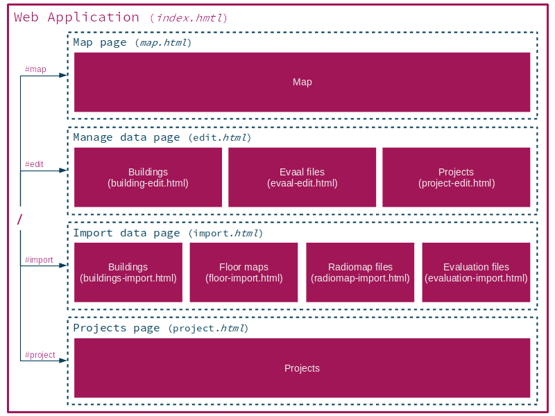

# FrontEnd Documentation

This file contains documentation regarding the structure and usage of the frontend.

# Table of Contents

  * [Libraries](#Libraries)
  * [File structure](#file-structure)
  * [Page overview](#page-overview)
  * [Site overview](#site-overview)
  * [Validation](#validation)

# Libraries

To make development easier several libraries were used for frontend development.
Here is a small overview:

- **AngularJS** - main UI framework
  - **angular-material** - material UI components
- **Openlayers** - html/js map library
  - **angular-openlayers-directive** - connect map with angular
- Others
  - **jquery** 
  - **Material Design Icons**
  
The main framework used is AngularJS which allows us to create a single page application easily.
We have used plugins like routes and messages to implement different functionality.
Angular-material is a framework for UI components. It provides reusable, tested and easily accessible UI components.
Openlayers was used to be able to display maps in our app. It uses *angular-openlayers-directive* to connect with angular.
The project also makes use of JQuery and Material design icons. The later provides different ready to use icons.

# File Structure

The frontend part of the application can be found in the folder `src/main/resources/static`.
It is structured like this:

```
static
├── index.html                      # main html page
├── app.js                          # main application definition
├── manifest.json                   # additional information for browsers
├── assets                          # assets like libraries and css
│   ├── css                             # own css files
│   ├── icons                           # own icons
│   └── vendor                          # external libraries (auto gen) 
├── pages                           # html/js files for pages
│   ├── map.html                        
│   ├── map.js
│   ├── ...
│   ├── forms                           # files describing parts of a page
│   │   ├── edit
│   │   │   ├── building-edit.html
│   │   │   ├── building-edit.js
│   │   │   └── ...
│   │   └── ...
│   └── panels                          # layouts for additional panels
└── components                          # services used by the pages
    ├── mapService.js
    ├── calculationService.js
    └── ...

```

- On the root the index.html can be found which is the entry point of our single page application,
it describes the outer layout and imports all needed libraries.
In addition you also find the app.js file which is the entry point of our angular application.
- The pages folders holds the dedicated pages (consisting of html and js with page logic) which are
injected by angular into the main html file to display the contents (e.g. map.html/js for the map view).
The subfolder forms holds single components describing dedicated parts of a page like the
edit-building.html/js for the building part of the edit page
- The components folder is for additional angular components not bound to a specific page,
it contains services e.g. the calculationService.js which provides access to the calculation API of the backend
to all pages which need it.

# Page Overview

As already stated the web application was designed as a single page application.
This does not mean though that there is only one page to work with, its only a single page as which is modified dynamically
using javascript. 
This means we also have a certain page hierarchy which you can see here:



The root (**/**) of the page is provided by the index.html, it does not contain any content (except Toolbar and Navigation) but redirects to the map page automatically.
From there you can access the map, manage, edit and project pages through the main menu. These pages then can have several sub pages (usually displayed as a tab bar) like the import building page.

Although it is delivered as a single html page to the browser, the sites are defined in single *.html* files (structure see above) with their own *.js* file if logic is needed.
A dedicated page like the map view may also be split up into multiple parts (.html files) although they are displayed at once (e.g. the map configuration side bar).
This makes it easier to keep an overview during development.

A description of the single pages is available at the [user guide](frontend_usage.md) of the frontend.