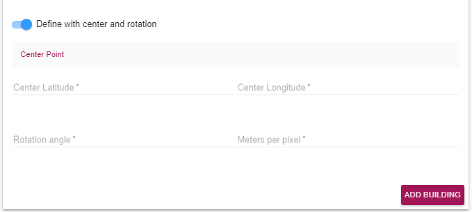
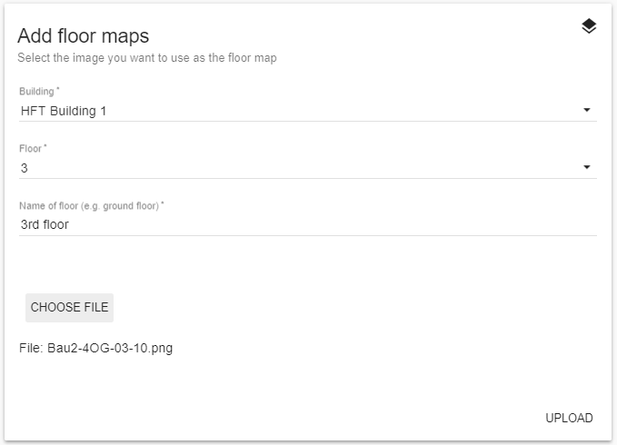
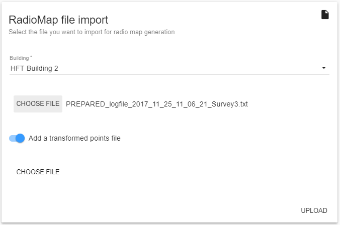
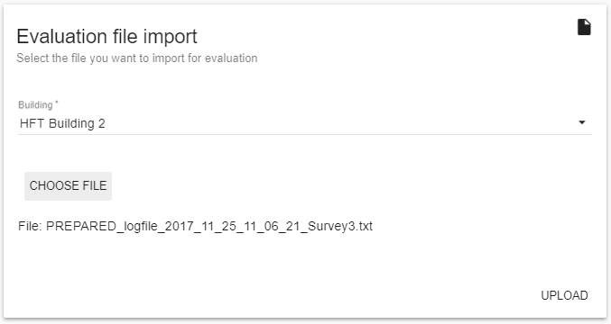
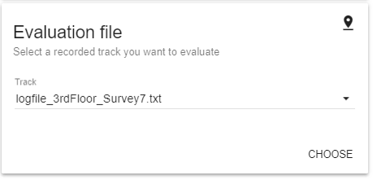
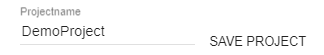

# FrontEnd Documentation

# Libraries
# File Structure
# Site Overview

In this section, different components and pages of the front end will be discussed as the front end plays an important role in our project. The components will be discussed according to the workflow i.e in the order how we will use the pages to get the final results.

## Toolbar

The toolbar is the main navigation element of the site. It is available at all pages which makes the navigation easy. Since the project makes use of the single page application, the toolbar is not required to be added in each html page and implemented only at one place.

The toolbar has two options represented with following icons.

 The first icon is . Once this menu button is clicked, the following side bar will appear.

 

 It has the following options

 - Map View
 - View Projects
 - Import Data
 - Manage Data

 The following sections will explain each of these menu options and submenus under them with respect to the workflow.

## Import Data

This section is dedicated for the import options. The data needs to be fed to the system to obtain the results. Once you click on the Import Data option from the navigation side bar, a secondary toolbar will appear below the main toolbar providing different import options. The second toolbar is shown below.

### Buildings

In this page, you can add building related data such as name, number of floors and dimensions of the floor map image.

It also has an option to add the cordinations either with *center and rotation* or add with *Latitudes and Longitudes*. Below images show these options.

To add the cordinates with *Center and Rotation* the radio button has to be turned on.

Even though these parts are explained separately, they are present in the single page.

Once the building is added successfully, a toast will appear like below.

### Floor Maps

This page is dedicated to upload the radio map file along with the building and floor selection which was added previously.

If the file is uploaded successfully, a toast will be displayed indicating the sucess or a error toast will guide the user.

### Radiomap Data

This page will allow the user to upload Radiomap file. The dropdown will provide the list of the building names which were added before. The user can also add transformed log file by switching on the *Add a transformed points file*. This file will be automatically converted to get the positions.

### Evaluation Data

The upload page for Evaluation file works similar to Radiomap upload. It also has a list of buildings for which the user wants to upload the evaluation file. Once the file is uploaded successfully, a toast will be displayed.

## Map View

Once all the data is uploaded successfully in the Import Data section, the results can be fetched in Map View. At the right hand side,  button will toggle a side panel. The panel has different parameters to choose from.

The first block provides the list of buildings and the floors available for that building. Once the user clicks on *CHOOSE* button, next block will appear.

Next block allows the user to choose from a prerecorded track for the evaluation.

After the evaluation file has been choosen, the user has to choose from different algorithms.

The panel provides many more parameters to play with. These can be accessed under *SHOW MORE PARAMETERS*. These set of parameters can be saved as a project so that the user can reuse the same set of parameters.

# Validation

