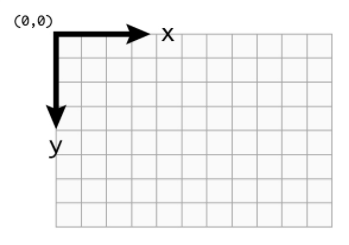
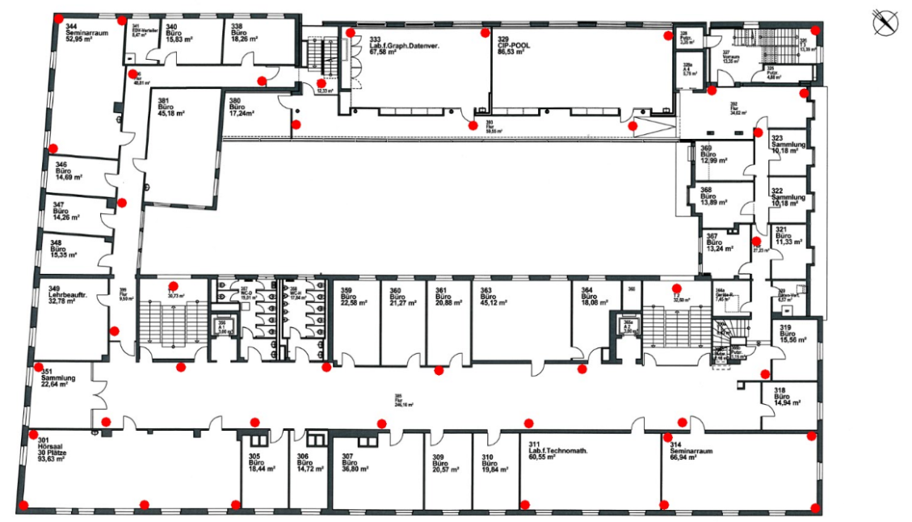
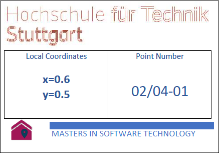
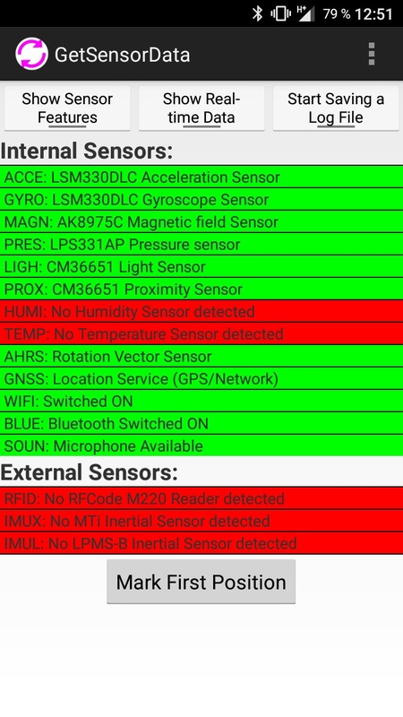
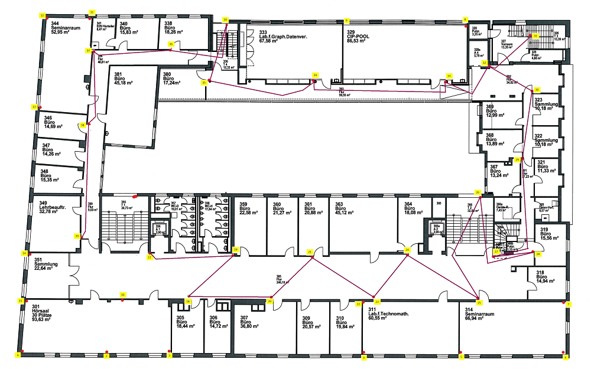

# Radiomap Documentation

This documentation is about the creation of a radiomap log-file and the according transformation file.

## Basics

In this section the Android application for the generation of the log-files and the different coordinate systems that are needed are described.

### Measurement application

For recording the radiomap-log-files the Android application GetSensorData of the LOPSI Research group is used. The Application can be downloaded from the following link:

https://lopsi.weebly.com/downloads.html

To install it on an Android phone you have to allow the installation of application from unknown sources. You can enable this option in the "security"-section of the settings. 

After this you have to transfer the downloaded apk to your phone. Open your favorite file-manager and navigate to the saved apk. To install the apk you simply have to open it and press the "install"-button on the popup. 

### Coordinate systems

For the preparation and usage of the radiomap are several different coordinate systems necessary. These coordinate systems are described in this section.

#### Picture / Screen coordinate system

The picture or screen coordinate system is the normal 2D coordinate system every computer uses for defining positions of some objects on a screen or a picture. The origin of this coordinate system is in the upper left corner.

 

#### Mathematical coordinate system

The main difference between the screen coordinate system and the mathematical coordinate system is the origin of ths systems. The mathematical system has it's origin in the lower left corner. This means, that the y-axis points upwards instead of downwards. Also it is possible that the mathematical system has a third dimension. In our case this can be for example the floor level. This coordinate system is needed in the backend for the transformation between the screen coordinate system and the latitude/longitude(WGS84) coordinate system. 

#### Latitude/longitude coordinate system (WGS84) 

The Latitude/longitude coordinate system is a coordinate system that tries to model the earth. For this purpose it uses an ellipsoid and the center of this ellipsoid is the origin of the system. This coordinate-system is used for the GPS-System and for map-services like Google-Maps. 


## Record Radiomap

In this section the generation of a radiomap log-file is described. Generally you can divide this task in the following sub-tasks.

- define reference points
- extract the coordinates of the reference points
- mark the reference points
- do the measurement

### Define reference points

Reference points are the calibrated points where the RSS value is measured which include coordinate information as well and used to store in the database.

The reference points should be placed regularly over the building where a navigation should be possible. For example like this:



### Extract coordinates

The pixel co-ordinates(X,Y) are determined from a given floor maps using picture editor in the following manner:
- Open the floor plan in the .jpeg/.png format with an image editing program like paint or gimp
- Place the cursor on the point of interest(marked reference points) on the floor plan
- Record the pixel-coordinates, normally they are displayed on the left-hand bottom corner of the window, which corresponds to the X and Y coordinates respectively.

### Mark reference points

To Mark the Reference points which are feasible physically, you need to do so with labels also known as Patches. The following information for example can be incorporated in the Patch:
-  Reference Point Number: Eg. 2/03-05, where 
	1.	2-building number
	2.	03-floor number
	3.	05-reference point number
-  X,Y coordinates in meters

For example: 



### Measurement

After starting the application for the measurement you get a start-screen similar to this.



You can see the different sensor-types the application can record. The ones that are colored in red aren't supported by the phone.

The application has four buttons that provide different functionality:

- Show Sensor Features: Shows the technical details of each sensor.
- Show Real-Time Data: Shows the actual measured data for each sensor.
- Start Saving a Log File: Generates a log-file in the internal memory of the phone. The log-file ends when the button is pressed again.
- Mark First Position: Generates a POSI-entry in the log-file. 

To start the measurement you have to press the "Start Saving a Log File" button and then walk through the building to the previous marked reference positions. At every reference position you have to press the "Mark First Position" button. Also you have to write down in which order the reference points are recorded. This can be done by writing a field-book. The field-book should contain the following informations:

- Date and start-/stop-time
- phone-model
- order of the measured reference points

This can be done either as text or as graphic.



When all reference points are measured you have to stop the measurement with the "Stop Saving a Log File" button and close the application. The application now has generated the log-file in the folder "LogFiles_GetSensorData" in the internal memory of the phone.
To get the log-files from your phone, you can either connect your phone with a computer or insert a microSD-card into the phone and copy the log-file.

## Create CSV-import-file

After the measurement the user has to create a CSV-file to include the coordinates into the generated log-file. The CSV-file has to include the following informations:

- Point-number
- x-coordinate in pixel as integer
- y-coordinate in pixel as integer
- building number as integer
- floor number as integer

Also the points have to be ordered according to the sequence of the measurements. The separator inside the CSV-file hast to be a semi-colon. For example a CSV-file could look like this:

```
6;2066;1253;2;0
8;2793;1576;2;0
12;3313;241;2;0
11;2935;443;2;0
9;3171;1763;2;0
10;3173;1209;2;0
```

This files must then be uploaded through the frontend for the radio-map or evaluation-file import. The backend will transform the coordinates into WGS84 and include them into the saved radiomap.