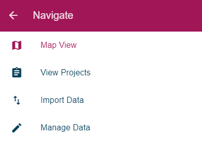
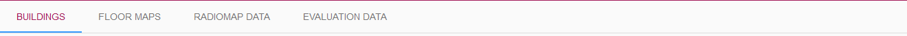

# FrontEnd Documentation

## Libraries
## File Structure
## Site Overview

In this section, different components and pages of the front end will be discussed as the front end plays an important role in our project. The components will be discussed according to the workflow i.e in the order how we will use the pages to get the final results.

### Toolbar

The toolbar is the main navigation element of the site. It is available at all pages which makes the navigation easy. Since the project makes use of the single page application, the toolbar is not required to be added in each html page and needs to be implemented only at one place.

The toolbar has two options represented with following icons.

 Once the menu button   is clicked, the following side bar will appear.

 

 It has the following options

 - Map View
 - View Projects
 - Import Data
 - Manage Data

### Import Data

This section is dedicated for the import options. The data needs to be fed to the system to obtain the results. Once you click on the Import Data option from the navigation side bar, a secondary toolbar will appear below the toolbar providing different import options. The second toolbar is shown below.

## Validation

